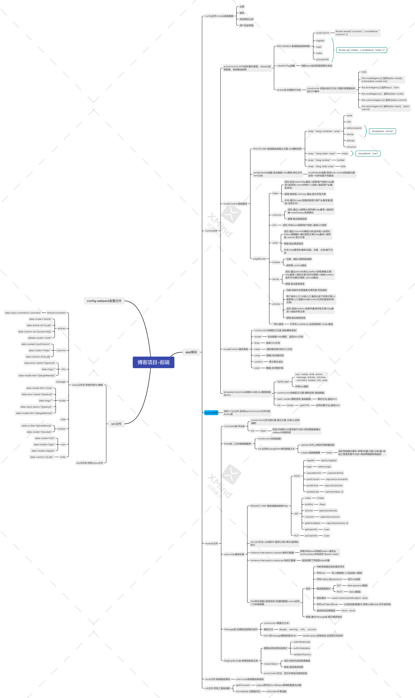
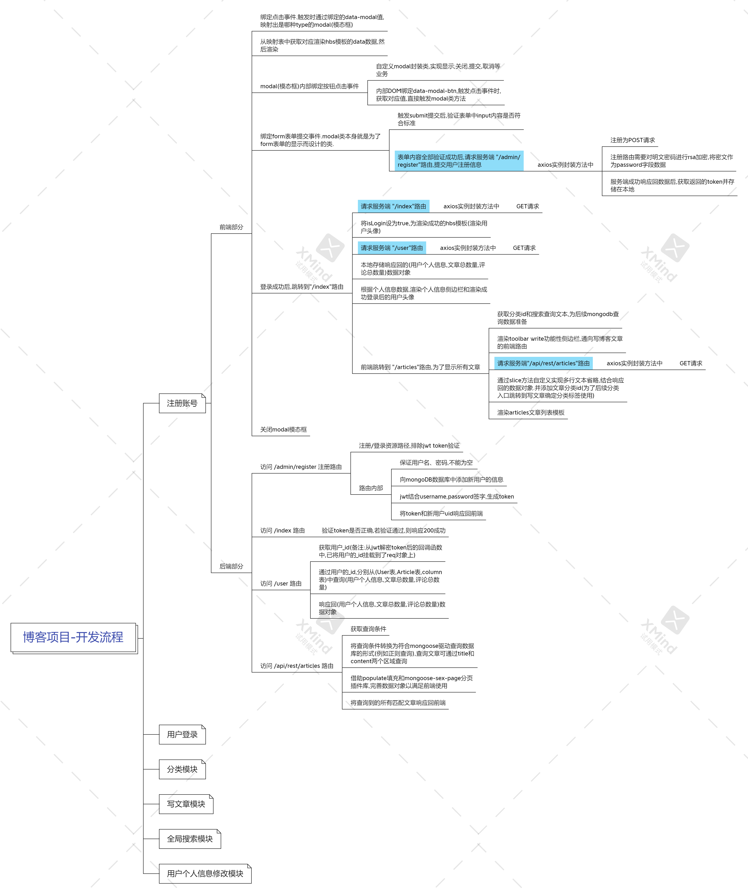

# 多用户文章社区系统

前后端分离的博客社区平台，支持文章发布、评论互动、实时聊天、文件上传等功能。

## 技术栈

**前端**
- Vue 3（Composition API）
- Vue Router 4、Pinia 状态管理
- Element Plus（桌面端）+ Vant 4（移动端自适应）
- Socket.IO Client（实时聊天）
- Axios + RSA 加密登录
- Vite 5 构建

**后端**
- Express.js
- MongoDB + Mongoose
- JWT（RSA 签名）身份认证
- Multer 文件上传
- Socket.IO（WebSocket 聊天 + 顶号检测）
- PM2 进程管理

## 功能

| 模块 | 说明 |
|------|------|
| 用户注册/登录 | RSA 加密传输，JWT Token 鉴权 |
| 文章发布/编辑/删除 | 富文本编辑器，分类栏目，封面图 |
| Markdown 渲染 | 支持代码高亮 |
| 评论互动 | 文章评论增删 |
| 文章点赞 | 点赞/取消切换 |
| 文件上传 | 头像上传 + 文章图片，20MB 限制 |
| 全文搜索 | 标题 + 内容正则检索 |
| 实时聊天 | WebSocket 全局聊天室，顶号下线 |
| 个人中心 | 昵称/头像/签名修改 |
| 移动端适配 | 自动检测设备切换桌面/移动布局 |
| Live2D 看板娘 | 页面宠物挂件 |

## 项目结构

```
├── vue-blog/              # 前端项目
│   ├── src/
│   │   ├── views/         # 页面组件（Home/Article/Editor/User/Socket）
│   │   ├── components/    # 通用组件（Header/Aside/Comment）
│   │   ├── mviews/        # 移动端页面
│   │   ├── mcomponents/   # 移动端组件
│   │   ├── router/        # 路由配置
│   │   ├── stores/        # Pinia 状态管理
│   │   ├── api/           # HTTP 封装
│   │   ├── config/        # 配置文件
│   │   └── util/          # 工具函数
│   └── vite.config.js
│
├── express-sign/          # 后端项目
│   ├── routes/            # API 路由（bus/admin/user/upload/search/artLikes）
│   ├── models/            # Mongoose 数据模型
│   ├── core/              # RSA、Token、状态码
│   ├── middleware/        # 资源中间件
│   └── plugins/           # 关联查询/操作映射
└── 博客项目开发流程.png   # 项目架构图
```

## 快速开始

### 环境要求
- Node.js >= 18
- MongoDB >= 6.0
- npm >= 9

### 1. 启动后端

```bash
cd express-sign
npm install
# 确保 MongoDB 已运行（默认 127.0.0.1:27017）
npm start        # 开发模式，端口 3000
# npm run prd    # 生产模式（PM2）
```

### 2. 启动前端

```bash
cd vue-blog
npm install
npm run dev       # 开发模式，端口 5173
# npm run build   # 构建生产版本
```

### 3. 访问

- 前端页面：http://localhost:5173
- 后端 API：http://localhost:3000
- 聊天服务：ws://localhost:8888

## API 概览

| 接口 | 方法 | 说明 |
|------|------|------|
| `/admin/login` | POST | 用户登录（RSA 加密） |
| `/admin/register` | POST | 用户注册 |
| `/api/rest/articles` | GET/POST | 文章列表/发布 |
| `/api/rest/articles/:id` | GET/PUT/DELETE | 文章详情/修改/删除 |
| `/api/rest/comments` | POST | 发表评论 |
| `/api/rest/columns` | GET/POST | 栏目管理 |
| `/user` | GET/PUT | 用户信息查询/修改 |
| `/upload/:classify` | POST | 文件上传（user/article） |
| `/articles/likes/:id` | POST | 文章点赞/取消 |
| `/articles/search?q=` | GET | 全文搜索 |
| `/keys` | GET | 获取 RSA 公钥 |

## 预览截图





## License

MIT
